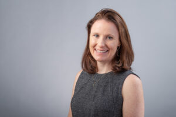
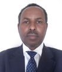
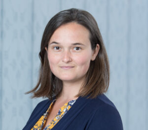

## Principal Investigators

### Degye Goshu

 Dr. Degye Goshu is currently a senior researcher at the Ethiopian Economics Association (EEA). He had pursued his studies in Agricultural Economics. He has 20 years of postgraduate teaching and research experience. He was an Associate Professor of Economics at Haramaya and Kotebe Metropolitan universities. His research experience includes welfare analysis, food and nutrition security, efficiency and productivity, market and price dynamics, impact evaluation, and livelihood analysis. He has published over 58 research works in reputed journals and books. He has coordinated various research and capacity building projects. 

Dr. Degye Goshu, in partnership with Dr. Mengistu Ketema, will lead the gender profitability gap analysis for Ethiopia and the exploration of the relationship between gender and the economy in Ethiopia.

### Gisella Kagy

 Dr. Gisella Kagy is an Assistant Professor of Economics at Vassar College with a research focus on development economics. Her research interests broadly cover how gender, firms, and labor markets interact and women’s empowerment. She has conducted experiments and collected original data in Ethiopia, Ghana, and Bangladesh. She holds a B.A. in mathematics and Ph.D. and MA in Economics from the University of Colorado at Boulder. She received a Hewlett Foundation/IIE Dissertation Fellowship to study women’s labor market participation in Bangladesh. 

Dr. Gisella Kagy, in partnership with Dr. Morgan Hardy, will lead the research team in analyzing the gender profit gap at the global level.

**Website**: [http://pages.vassar.edu/gisellakagy/](http://pages.vassar.edu/gisellakagy/)

### Mengistu Ketema 

 Dr. Mengistu Ketema is currently a senior researcher at the Ethiopian Economics Association (EEA). He obtained his BSc and MSc degrees in Agricultural Economics from Haramaya University and his Ph.D. Degree from the Justus-Liebig University of Giessen, Germany. He has 21 years of experience in research and teaching. He has published more than 60 articles in reputable journals, 10 proceeding papers, and five book chapters. He has also successfully coordinated and completed six collaborative projects.

Dr. Mengistu Ketema, in partnership with Dr. Degye Goshu, will lead the gender profitability gap analysis for Ethiopia and the exploration of the relationship between gender and the economy in Ethiopia.

### Morgan Hardy 

 Dr. Morgan Hardy an Assistant Professor of Economics in the Social Science Division of New York University Abu Dhabi.  Her research is in development economics, with a topical focus on firms and labor markets. Much of her work involves field experiments and/or original data collection in Africa. She has conducted field projects in Ethiopia, Ghana, and Nigeria, on topics including combating youth unemployment, improving small business profits, community-level impacts of industrialization, gender pay inequality, and the dynamics of small business owner networks. She holds a B.A. in mathematics and philosophy from Columbia University and a Ph.D. and MA in Economics from Brown University, where she received an NSF/IGERT fellowship for interdisciplinary training and fieldwork as well as a Hewlett Foundation/IIE Dissertation Fellowship to study women’s labor market participation in the developing world. She is keenly interested in women’s economic empowerment, social/business networks, and informal economic activity in Africa.

Dr. Morgan Hardy, in partnership with Dr. Gisella Kagy, will lead the research team in analyzing the gender profit gap at the global level.

**Website**: [https://sites.google.com/a/nyu.edu/morganhardy/home](https://sites.google.com/a/nyu.edu/morganhardy/home)

## Post-Docs

### Dr. Abule Mehare 

### Dr. Nusrat Jimi

## Pre-Docs

### Denat Ephrem Negatu

### Juan Pablo Rossi

### EEA's Predoc
